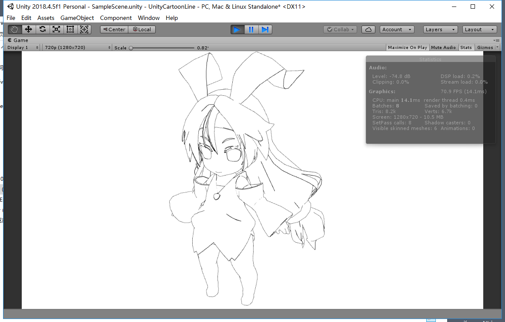

# UnitySimpleCartoonLine
使用模型网格生成的卡通描边  
代码有点乱，有些地方写得可能有点小错误，优化也没做到位，但效果是没错的，请自行整理。  
请不要直接用到项目中，仅作为demo提供参考，后果自负。  
使用方法：双击SampleScene场景，点击运行即可。  
原理：在[这里](https://www.cnblogs.com/lht666/p/11447199.html)  
>   
>   